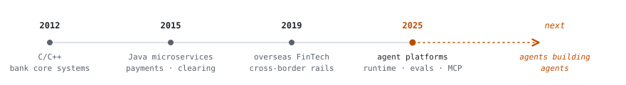

# Thin

**Building tools for the era when AI writes the code.**

工欲善其事，必先利其器。

[agents](https://github.com/seasonsolt/sac-agent) · [evals](https://github.com/seasonsolt/edd-skill) · [macOS menu bar apps](https://github.com/seasonsolt/tachi) · [digital twins](https://github.com/seasonsolt/twin)&nbsp;&nbsp;|&nbsp;&nbsp;e/acc · 加速&nbsp;&nbsp;|&nbsp;&nbsp;@seasonsolt

  <picture>
    <source media="(prefers-color-scheme: dark)" srcset="assets/banner-dark.svg">
    
  </picture>

Architect for 10+ years — fintech and e-commerce backends in Java, payment chains that held 10K+ QPS on peak days. Now a technical partner at an AI startup, leading a 10-person team building agent platforms: runtime, MCP hub, skills hub, model gateway. These days I mostly write Python and Swift — agents that code, evals that judge them, and small native apps that keep the whole loop visible from the macOS menu bar.

> Not "move fast and break things" — **move fast and measure everything.**

A few things I believe:

- **Eval-driven development.** Write the eval before the prompt — benchmark, golden set, LLM-as-judge. The eval *is* the spec.
- **Ambient tooling beats dashboards.** Agent status belongs in the menu bar, not in another browser tab.
- **Acceleration is a practice, not a vibe.** Ship the loop, tighten the loop, repeat.

  <picture>
    <source media="(prefers-color-scheme: dark)" srcset="assets/arc-dark.svg">
    
  </picture>

Same discipline the whole way: systems that hold under load. The load is just measured in tokens now.

 

## Now building

| project | stack | what it is |
|:--|:--|:--|
| [**twin**](https://github.com/seasonsolt/twin) | `Python` | Personal digital twin that answers, speaks and appears like the person — every claim cited from their own words |
| [**tachi**](https://github.com/seasonsolt/tachi) | `Swift` | Native macOS menu bar companion for live AI coding sessions, Claude usage & Codex quota |
| [**lancer**](https://github.com/seasonsolt/lancer) | `Java` | Debug one JVM microservice on your laptop against a shared Kubernetes cluster — only your requests hit your breakpoint |
| [**skills**](https://github.com/seasonsolt/skills) | `Python` | Verifiable, boundary-aware agent skills for creation, knowledge work and software engineering |
| [**edd-skill**](https://github.com/seasonsolt/edd-skill) | `Python` | A skill for eval-first AI coding workflows |
| [**sac-agent**](https://github.com/seasonsolt/sac-agent) | `Python` | Teaching-oriented terminal software-engineer agent — Textual, LangChain, DeepAgent |

Also: [**sac-agent4j**](https://github.com/seasonsolt/sac-agent4j) — the same agent ideas in Java, for my backend roots.

The names: `sac` is Stand Alone Complex, `tachi` a Tachikoma — the think-tanks that synced memories nightly. Agent tooling had a spec in 2002.

📦 More cargo in the hold

- [**agent-lab**](https://github.com/seasonsolt/agent-lab) — FastAPI coding agent with a local Langfuse stack, where the evals get run
- [**cqrses-order**](https://github.com/seasonsolt/cqrses-order) — CQRS / Event Sourcing order system demo (the Java roots run deep)
- [**ddia-skill**](https://github.com/seasonsolt/ddia-skill) — *Designing Data-Intensive Applications* as a study skill
- [**e-acc.ai**](https://github.com/seasonsolt/e-acc.ai) — you already know what this one is about ([live](https://e-acc.ai))
- [**ritual-screen**](https://github.com/seasonsolt/ritual-screen) — sacred token-consumption visualization for vibe coding

 

## Track record

- Built a vertical-agent platform — agent runtime, MCP hub, skills hub, model gateway — that took AI product delivery from idea to production **2–5× faster**.
- Shipped a legal-AI document workflow to overseas law firms and funds: **90%+ extraction accuracy** on 200+ page filings at **P99 ≈ 5s/page**.
- A decade of load-bearing backend work: order/payment/clearing systems, **10K+ QPS** promotion peaks, cross-border payment fees cut **0.5% → 0.2%**.

 

## Ask me about

*DDIA*, chapter by chapter — [ddia-skill](https://github.com/seasonsolt/ddia-skill) is me rereading it with an agent · eval philosophy, including where "the eval is the spec" breaks down · writing about all of this in 中文 — I think in two languages and debug in one · the avatar — start with Salinger

 

## Telemetry

<!-- The canonical github-readme-stats.vercel.app deployment is paused (DEPLOYMENT_PAUSED as of 2026-08); using the community mirror below. Swap the host back if the main instance returns. -->

  <picture>
    <source media="(prefers-color-scheme: dark)" srcset="https://github-readme-stats-sigma-five.vercel.app/api?username=seasonsolt&show_icons=true&include_all_commits=true&theme=github_dark&hide_border=true&bg_color=00000000">
    
  </picture>
  <picture>
    <source media="(prefers-color-scheme: dark)" srcset="https://github-readme-stats-sigma-five.vercel.app/api/top-langs/?username=seasonsolt&layout=compact&langs_count=6&hide=html&theme=github_dark&hide_border=true&bg_color=00000000">
    
  </picture>

  <!-- mode=weekly is deliberate: sustained pace over daily box-ticking -->
  <picture>
    <source media="(prefers-color-scheme: dark)" srcset="https://streak-stats.demolab.com/?user=seasonsolt&mode=weekly&theme=github-dark-blue&hide_border=true&background=00000000">
    
  </picture>

 

Worth an email: agent platforms in production, eval harness design, or a menu bar app that should exist — <a href="mailto:seasonsolt@gmail.com">seasonsolt@gmail.com</a>

「唯快不破」 — nothing beats speed.

